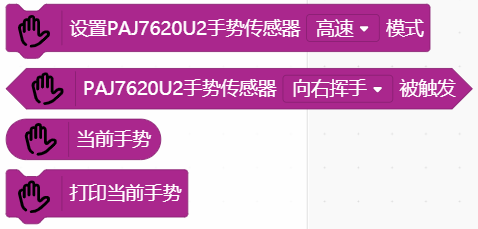
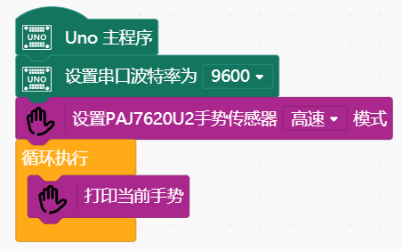

#  PAJ7620U2 Gesture Sensor 手势识别传感器


---------------------------------------------------------

## 目录

* [相关链接](#相关链接)
* [描述](#描述)
* [积木列表](#积木列表)
* [示例程序](#示例程序)
* [许可证](#许可证)
* [支持列表](#支持列表)
* [更新记录](#更新记录)

## 相关链接
* 本项目加载链接: ```https://github.com/dong223/dai-ext-PAJ7620U2-Gesture-Sensor- ```

* 用户库教程链接: ```https://mindplus.dfrobot.com.cn/extensions-user```

* 购买此产品: [商城](https://www.dfrobot.com.cn/).

## 描述
  PAJ7620U2手势识别传感器是一款以IIC通信的3D手势识别交互式传感器。工作电流仅3.5mA, 手势识别距离达20mm。在最远20cm范围内，可以识别的手势多达13种。该手势传感器具备良好的手势识别稳定性，反应快，准确率高，可识别多种手势。支持两种手势识别模式，高速模式（可识别9种）和低速模式（可识别13种）。支持用户自定义识别手势。

  PAJ7620U2手势识别传感器在高速模式下可识别上，下，左，右，前，后，顺时针，逆时针，快速挥手。而低速模式除了支持高速基础包含的所有手势外，还支持慢速上下，慢速左右，慢速前后，乱序。此外，低速模式可以自定义单位采样时间，还可根据自己需要轻松定义识别手势。

## 积木列表




## 示例程序



## 许可证

MIT

## 支持列表

主板型号                | 实时模式    | ArduinoC   | MicroPython    | 备注
------------------ | :----------: | :----------: | :---------: | -----
arduino            |             |       √       |             | 
leonardo           |             |        √      |             | 


## 更新日志
* V0.0.1  基础功能完成
* V0.0.2  根据Mind+V1.6.2 RC2.0更新此库
